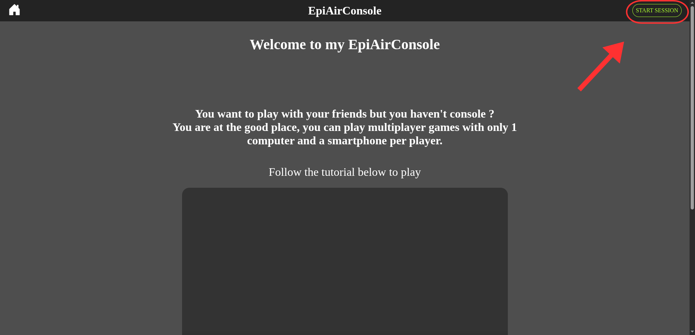
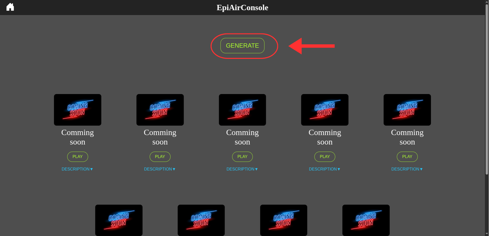
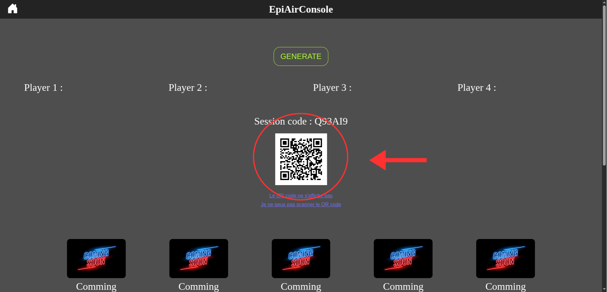
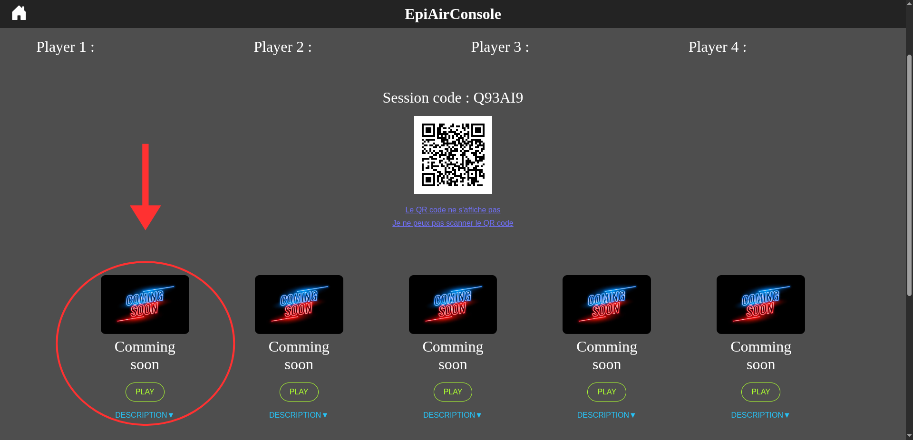

# EpiAirConsole

EpiAirConsole is an online platform that lets people play multiplayer video game using their smartphones as controllers. It basically turns any screen with a web browser (computer, smart TV, tablet) into a console, and players connect via their phones by scanning a QR code.


## Table of Contents

 - [Project Description](#project-description)
 - [Useful information](#useful-information)
 - [Badges](#badges)
 - [Usage](#usage)
 - [Project Structure](#project-structure)
 - [Development](#development)
 - [Contributors](#contributors)


## Project Description

The EpiAirConsole is a simulated professional work aims to teach us best practices in business.
For example:
 - submit a weekly report
 - write a complete documentation
 - ...

In this project there are three main parts to develop:
 - a main web page, to display main informations about the platform, all games available and QR code to connect controllers (smart phones) to the session.
 - an interface for controllers to have the right button depending on what game people are playing.
 - a server that stores all informations and communicate with main screen and controllers.

For this project I have chosen the following technologies:
 - server: Node.js
 - main web page / controllers: html/css/javascript
 - games: Phaser.js (/ C#/Unity)


## Badges


## Useful information

 1. The site is only usable in local mode (localhost).
 2. A session is deleted after 10 minutes of inactivity.


## Usage

To use my EpiAirConsole you need to:
 - ### Clone the repository. In a terminal, copy this:
 ```
 git clone https://github.com/EpitechPGE3-2025/G-PRO-500-LIL-5-1-professionalwork-11
 ```

 - ### Then, start the site (always in your terminal):
 ```
 npm start
 ```

 - ### Now, go on your web browser and search for *http://localhost:3000*
   You will be able to watch a tutorial to play games.

 - ### If you can't see the tutorial, here is how to create session and chose a game:
   - When you are on the home page of the site click on the button *START SESSION* on top right\
    

   - You are redirected to the session page. Now, you have to generate the session code by clicking on the *GENERATE* button.
    

   - Then, a QR code will be displayed. You need to scan it to join the session.
    

   - Finally, you can chose a game.
    


## Project Structure

```
EpiAirConsole/
|
|--Documentation/
|  |--image/
|  |  |--images to illustrate the README file
|  |
|  |--README.md
|
|--public/
|  |--controller/
|  |  |--pages for front-end and back-end for smartphone's controller
|  |
|  |--images/
|  |  |--images of available games
|  |
|  |--html/css/js files for home/session pages
|
|--server/
|  |--server.js (manage everything necessary for the site like session managing)
|
|--tests/
|  |--files to test several function of the server
|
|--package.json
```


## Development

To develop this project, I created a Kanban board to group together all the tasks I will need to complete.\
\
First, I created the server part to allow player to create and join a session.\
\
Second, I created the front-end pages for home, session and controllers. It include the display of all games, form to join a session and a tutorial video to explain how create a session and chose a game.\
\
Third, I created my first multiplayer game.\
\
Still in progress...


## Contributors

 - Clément Augustinowick (clement.augustinowick@epitech.eu)
